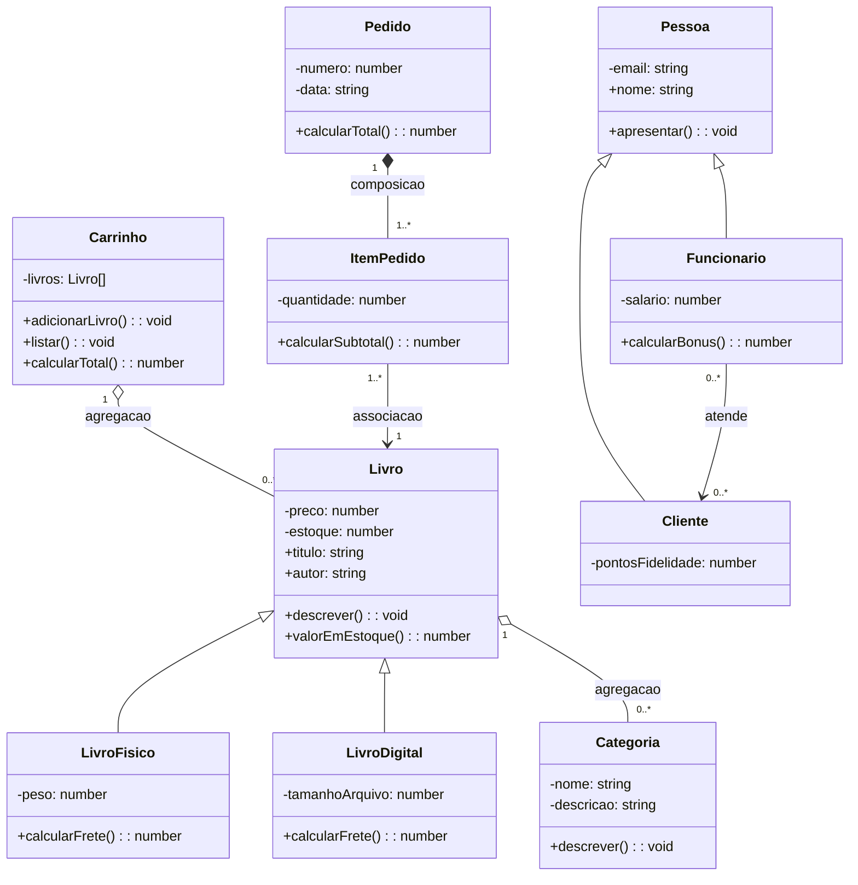

# 🔑 Gabarito — Atividade 05: Diagrama de Classes da Livraria

**Uso exclusivo do professor.**

---

## Diagrama de referência (Mermaid)

O bloco abaixo é código [Mermaid](https://mermaid.js.org) — cole em qualquer editor compatível (GitHub renderiza automaticamente em arquivos `.md`, e o [Mermaid Live Editor](https://mermaid.live) mostra o desenho na hora) para visualizar o diagrama completo.

> ⚠️ Nota de leitura do Mermaid: a sintaxe `ClasseA <|-- ClasseB` significa **ClasseB herda de ClasseA** (o triângulo aponta para a classe-mãe, `ClasseA`) — mesma leitura ensinada em aula.

---

## O que cada relação avalia (e os erros mais prováveis)

| Relação                 | Tipo esperado  | Erro provável do grupo                                                            |
| ----------------------- | -------------- | --------------------------------------------------------------------------------- |
| `LivroFisico`/`Livro`   | Herança        | Nenhum — já dominado desde 07/08                                                  |
| `Cliente`/`Pessoa`      | Herança        | Nenhum — idem                                                                     |
| `Livro`/`Categoria`     | **Agregação**  | Grupo mantém como "composição", repetindo a simplificação de 12/08 sem refinar    |
| `Carrinho`/`Livro`      | **Agregação**  | Mesmo erro acima — é o ponto central do refinamento de hoje                       |
| `Pedido`/`ItemPedido`   | **Composição** | Grupo usa agregação por hábito, sem aplicar o teste "a parte sobrevive?"          |
| `ItemPedido`/`Livro`    | Associação     | Grupo tenta modelar como agregação (confundindo "referenciar" com "possuir")      |
| `Funcionario`/`Cliente` | Associação     | Grupo tenta herança ou composição por não saber onde encaixar uma relação "fraca" |

**O ponto de maior valor pedagógico é `Livro`/`Categoria`.** Se o grupo repetir "composição" aqui sem questionar, é sinal de que decorou o rótulo usado em 12/08 em vez de aplicar o teste. Vale perguntar diretamente: _"se vocês apagarem esse livro do sistema, a categoria Tecnologia desaparece junto?"_ — a resposta ("não, outros livros ainda usam") entrega a resposta certa (agregação) sem que você precise dizer.

---

## Respostas esperadas — Parte 3 (discussão em grupo)

**1. Por que `Livro`/`Categoria` é agregação, e não composição?**
Porque a categoria não pertence exclusivamente a um livro — vários livros compartilham a mesma categoria, e ela continua existindo mesmo que um livro específico seja removido do catálogo.

**2. Por que `Pedido`/`ItemPedido` é composição, e não agregação?**
Porque um `ItemPedido` só existe **dentro** de um pedido específico — ele não tem sentido isolado, e se o pedido for cancelado/apagado, os itens dele deixam de existir junto.

**3. O que `ItemPedido`/`Livro` (associação) tem de diferente das outras relações da tabela?**
Não é uma relação de posse ("tem um") — é uma relação de **referência**. O `ItemPedido` aponta para qual livro foi pedido, mas não é "dono" do livro, nem o livro deixa de existir sem aquele item específico. É a relação mais fraca das quatro, por isso usa só uma seta simples.

> 🔎 **O que caracteriza domínio, nas três respostas:** o grupo consegue aplicar o teste ("a parte sobrevive sem o todo?") a cada caso **específico**, em vez de recitar a definição genérica de agregação/composição decorada do guia.

---

## Multiplicidades de referência

| Relação                   | Multiplicidade esperada | Por quê                                                                                                                                                                                                                 |
| ------------------------- | ----------------------- | ----------------------------------------------------------------------------------------------------------------------------------------------------------------------------------------------------------------------- |
| `Carrinho` → `Livro`      | `1` para `0..*`         | Um carrinho pode estar vazio (`0`) ou ter vários livros                                                                                                                                                                 |
| `Livro` → `Categoria`     | `0..*` para `1`         | Vários livros podem ter a mesma categoria; uma categoria é obrigatória por livro (não faz sentido livro sem categoria) — vale discutir se o grupo modelou `Livro` como `1` (obrigatório) corretamente, em vez de `0..1` |
| `Pedido` → `ItemPedido`   | `1` para `1..*`         | Pedido vazio não existe — pelo menos um item                                                                                                                                                                            |
| `ItemPedido` → `Livro`    | `1..*` para `1`         | Vários itens de pedidos diferentes podem referenciar o mesmo livro; cada item aponta para exatamente um livro                                                                                                           |
| `Funcionario` → `Cliente` | `0..*` para `0..*`      | Um funcionário atende vários clientes ao longo do tempo, e um cliente pode ser atendido por vários funcionários — não há uma regra fixa de "um para um" aqui                                                            |

> A multiplicidade de `Funcionario`/`Cliente` costuma gerar debate saudável entre os grupos — não existe uma resposta única "certa" sem mais contexto de negócio definido. Se um grupo justificar `1` para `0..*` (um funcionário fixo atende vários clientes, sem clientes trocarem de atendente), aceite como válido **desde que o grupo explique a regra de negócio que adotou.**

---

## Checklist de correção rápida (por grupo)

- [ ] 10 classes desenhadas (8 existentes + `Pedido` + `ItemPedido`), com os 3 compartimentos
- [ ] 4 relações de herança com triângulo vazio, apontando para a classe-mãe
- [ ] `Livro`–`Categoria` e `Carrinho`–`Livro` com losango **vazio** (agregação)
- [ ] `Pedido`–`ItemPedido` com losango **cheio** (composição)
- [ ] `ItemPedido`–`Livro` e `Funcionario`–`Cliente` com seta simples (associação)
- [ ] Ao menos 3 multiplicidades indicadas, coerentes com a regra de negócio
- [ ] Grupo sustenta oralmente as 3 respostas da Parte 3, aplicando o teste em vez de recitar definição
- [ ] Imagem exportada e commitada em `docs/diagrama-classes-v1.png` no repositório do grupo
